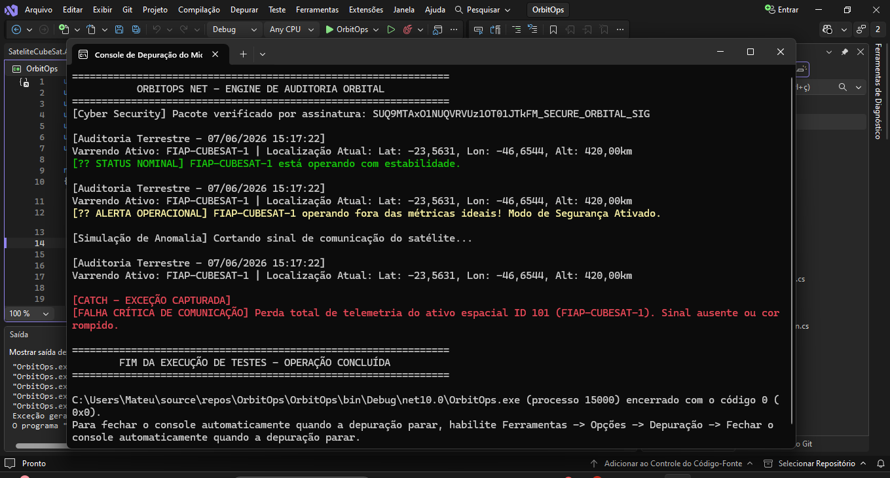

# OrbitOps.Net - Governança Operacional Aeroespacial

---

## Descrição do Projeto
O **OrbitOps** é um ecossistema corporativo de ITSM (Gerenciamento de Serviços de TI) e Governança Operacional desenhado especificamente para a infraestrutura da *New Space Economy*. O sistema aplica os conceitos consolidados de governança de TI (ITIL) para monitorar e auditar o ciclo de vida e a integridade de constelações de nanossatélites (CubeSats) e sua integração com estações terrenas.

Este módulo desenvolvido em **C# (.NET Core)** funciona como o motor core de auditoria, interceptando dados de telemetria orbital, aplicando regras de segurança contra anomalias severas e garantindo tratamento robusto a falhas críticas para impedir interrupções catastróficas em sistemas espaciais.

---

## Integrantes do Grupo
* **Nickolas Moreno Cardoso** - RM557132
* **André Giovane de Maria** - RM556384
* **Mateus dos Santos da Silva** - RM558436
  
---

## Como Executar a Aplicação
1. Certifique-se de possuir o `.NET SDK` instalado na máquina.
2. Clone o repositório público do projeto.
3. Navegue até o diretório raiz do projeto por meio do terminal.
4. Execute o comando de compilação e inicialização automática:
   ```bash
   dotnet run
   
---

## Requisitos Técnicos Implementados (.NET / SOA)
Modelagem de Domínio & POO: Criação de classes especializadas estruturadas com encapsulamento, herança de propriedades e polimorfismo dinâmico (SateliteBase, SateliteCubeSat).

Abstração & Interfaces: Isolamento completo de regras de negócios por meio da interface IGovernancaEngine promovendo acoplamento fraco e testabilidade.

Lógica e Tratamento de Datas: Rastreabilidade temporal rígida utilizando registros de auditoria capturados por DateTime.Now.

Tratamento de Exceções Críticas: Captura direcionada da exceção customizada FalhaSinalSateliteException, prevenindo encerramentos abruptos no console de controle.

Estruturas Auxiliares Avançadas: Implementação de alocação otimizada por meio de struct (CoordenadasOrbitais) e divisão organizacional de propriedades utilizando classes partial (SateliteCubeSat).

Módulo Cyber Security: Integração de rotina de verificação estática (CriptografiaUtil) para validação de integridade por assinatura digital de payloads, combatendo riscos de Spoofing.

---

## Evidências de Execução de Testes



---

## PASSO 6: O Diagrama de Fluxos Exigido

Para garantir os **5 pontos do Diagrama de fluxos** pedidos no edital, desenhe em qualquer ferramenta visual (Draw.io, Figma, Lucidchart) um fluxo linear simples contendo os seguintes passos do código:
1. **Início** -> Recebimento dos Dados de Telemetria.
2. **Camada Cyber** -> Geração da Assinatura Criptográfica do Payload.
3. **Validação de Sinal** -> Bloco de Decisão: *O sinal está ativo?*
   * *Se NÃO:* Dispara `FalhaSinalSateliteException` -> Captura pelo Bloco `Catch` -> Log de Erro Crítico -> Fim.
   * *Se SIM:* Segue para a validação de subsistemas.
4. **Análise de Métricas** -> Bloco de Decisão: *Temperatura > 55°C ou Energia < 15%?*
   * *Se SIM:* Ativa Modo de Segurança no Satélite -> Exibe Alerta Operacional no Console.
   * *Se NÃO:* Mantém Status Nominal Operacional.
5. **Fim** -> Log de encerramento da auditoria de rotina com data e hora atualizadas.
